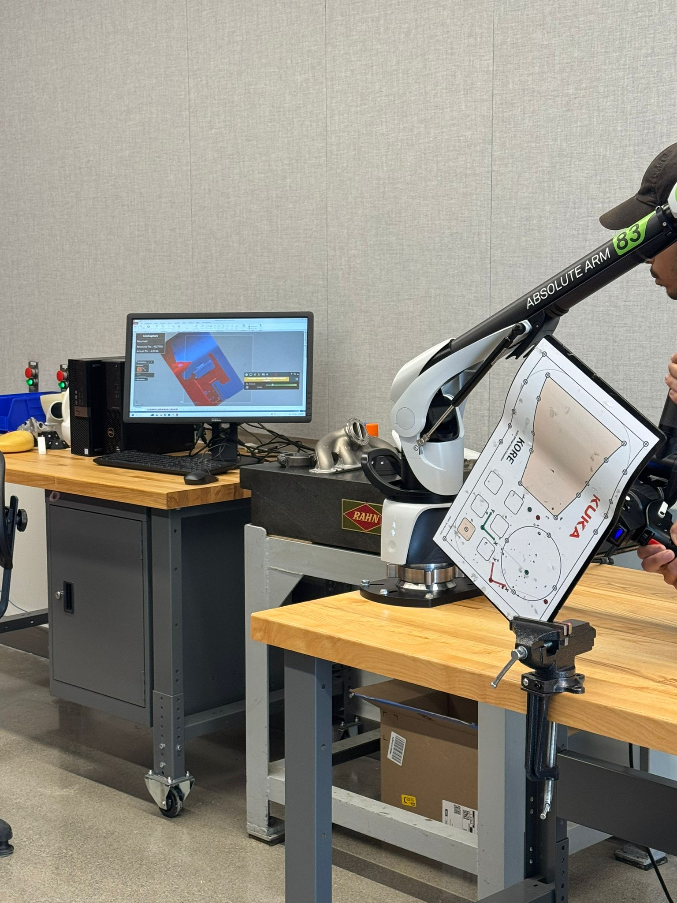

# NX Digital Twin & Simulation

> Siemens NX with MCD (Mechatronics Concept Designer) for digital-twin validation, plus Tecnomatix and Node-RED integration — covering CAD design, simulation, and real-robot scan-to-engrave workflows.


This repo bundles work from **CAD555 — Electrical and Mechanical Design and Simulation** and **SIM655 — Simulation for Design and Manufacturing** at Seneca Polytechnic. Both courses lean heavily on Siemens NX with **MCD (Mechatronics Concept Designer)** for kinematic and sensor-aware simulation; SIM655 adds Tecnomatix for material-flow simulation and Node-RED bridges for live data into NX models.

---

## What's in here

### CAD555 — design + MCD foundations

- Mechanical design and detailed drawings with tolerance stacks, multiple views, dimensioning per drawing standards
- Animations and exploded-views for assembly instructions
- **MCD simulation of a Festo MPS station** — defining sensors (capacitive, inductive, light barriers), actuators (linear cylinders, rotary drives), and signal connections so the model behaves like the real station

### SIM655 — engrave + scan + Tecnomatix

The flagship deliverable was a **scan-to-engrave** workflow:

1. **Scan** a target plate (KUKA KORE plate or a custom fixture) with a Romer Absolute Arm to capture true position
2. **Import** the scan into NX, align with the model's coordinate system
3. **Define robot rules** in NX so the engrave path respects orientation and reach
4. Run the path on the physical KUKA robot at sub-mm accuracy
5. Bridge MCD with **Node-RED** so live process variables (and Tecnomatix-driven material flow) feed back into the simulation


*Romer Absolute Arm scanning a KUKA KORE plate — the scan establishes ground-truth position so the robot's engrave path lands on the right geometry*

---

## Tech Stack

| Layer | Technology |
| --- | --- |
| **CAD** | Siemens NX — modeling, drawings, assemblies, animations |
| **Twin** | Siemens NX MCD — kinematics, sensors, actuators, signal flow |
| **Material flow sim** | Siemens Tecnomatix Plant Simulation |
| **Bridge** | Node-RED — live data into MCD models |
| **Robot** | KUKA — engrave/scan execution |
| **Metrology** | Romer Absolute Arm — sub-mm scanning for tool/workpiece calibration |

---

## Highlights

- **Festo MPS digital twin.** Sensors and actuators wired up correctly inside MCD so the simulation matches the real station — sensor false triggers, actuator timing, signal-debounce behavior all faithful
- **Scan-to-engrave on a real robot.** Romer scan → NX alignment → robot rules → physical engrave — closes the loop between metrology, simulation, and execution
- **Tecnomatix for material flow.** Modeled the lab sorter with Tecnomatix to study throughput, buffer fill, and bottlenecks before changing the physical setup
- **Node-RED ↔ MCD bridge.** Live process state from the cell streamed into the simulation in real time, so the twin reflects what the equipment is actually doing

---

## What I learned

- **Twins are only as useful as their fidelity.** A model that cuts corners on sensor behavior gives you confidence right up until the real station fails differently. Spending time on sensor models was the highest-leverage thing I did.
- **Scan first, plan second.** Trying to plan paths against the nominal CAD model — without scanning the actual workpiece — wastes everyone's time. Even a quick scan dramatically improves first-attempt accuracy.
- **Tecnomatix is for the *system*, MCD is for the *machine*.** They answer different questions. Tecnomatix tells you whether the line throughput will hit the target; MCD tells you whether each individual machine will actually move correctly.
- **The twin's value is in cycle time, not just risk reduction.** Yes, you avoid collisions. But you also iterate faster — change a parameter, re-run, see the result in seconds instead of after a 5-minute physical reset.

---

## Repo contents

```
.
├── README.md
├── nx-models/            # NX part / assembly files (.prt)
├── mcd-twins/            # MCD scenes — Festo MPS, scan-engrave cell
├── tecnomatix/           # Plant Simulation models for material flow
├── node-red/             # Bridge flows linking MCD to live process data
├── docs/
│   ├── scan-engrave-workflow.md
│   ├── mps-twin-sensor-map.md
│   └── design-example-w22.pdf
└── assets/
```

---

📫 **Harpreet Singh** — [harpreetsingh.cloud](https://harpreetsingh.cloud) · [GitHub](https://github.com/harpreetsingh52004)
